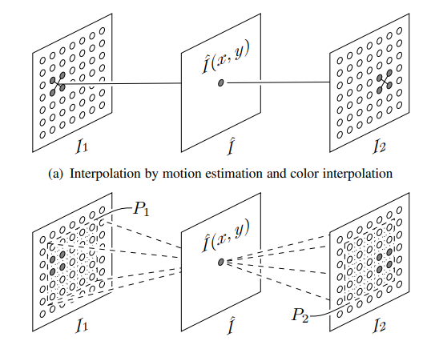
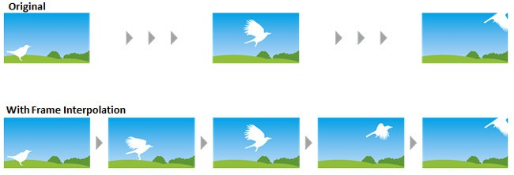
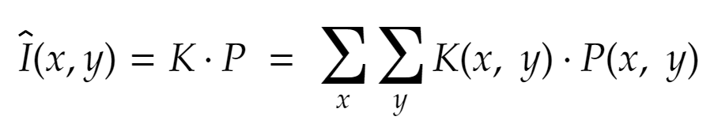
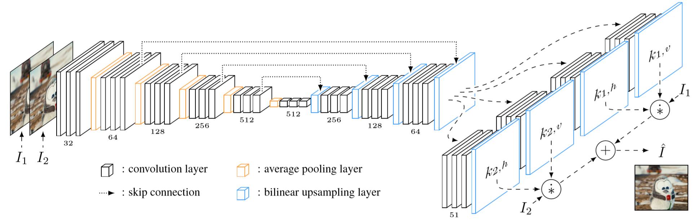
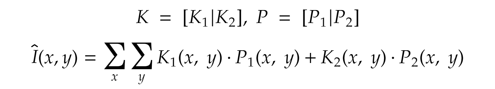
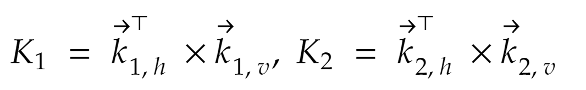

# Video-Frame-Interpolation

## Description

## Environment Setup

## Running

# Final Report

## Introduction and diagram for the Video Frame Interpolation project
When we watch movies and TV shows online today, most of them are 24fps format. As most of our screens like monitors or television are 60hz or even 120hz frame rate or more, use Figure 1 as example. We will see some common artifacts on the screen if we watch these videos on our screen. The reason for the artifacts occurring is because the low frame rate video will lose moving detail during the movement.

 

To avoid these common artifacts we want to create a program that is powered by Video Frame Interpolation technology to convert 24fps video to 60fps video. This is a technology that aims to generate non-existent frames in-between the original frames. The usage of this technology can be used not only frame rate up-conversion but also the slow-motion video. 

Triditional video frame interpolation methods are using the estimate optical flow to predict the movement of the object between input frames and synthesizing intermediate frames. However the performance will be vary depends the quality of optical flow. Futhermore, the optical flow methods still challenging to generate high-quality frames due to large motion and occlusions. 

Since the goal of this project is to produce high-quality frame between existing frames, we decide to use the kernal based method to predict the frame. This method is to estimate spatially-adaptive convolution kernels for each output pixel and convolve the kernels with the input frames to generate a new frame. Specifically, for each pixel in the interpolated frame, the method takes two receptive field patches centered at that pixel as input and estimates a convolution kernel. The difference between these two method are shown as Figure 2.

As you can see in Figure 3, the object moves from one frame to the next frame. The model use kernal to draw the missing frame and then insert it in-between these two frames. The missing frame is generated by the CNN network with the other two frames as input.

 

For the test part, we will use 60fps frames videos to train our model as shown in Figure 4. Each video in the data set will be process in three set of rames:t, t+1, t+2, where t is from 1th frames to 58 frames. We will use the t frame and t+2 frame as input and t+1 frame as ground truth. The output frame will be used to compare with the original t+1 frame to accurately model.

 

## How it is related to Deep Learning for CV 
Traditional methods use optical flow for frame interpolation. However, in general, optical flow cannot be calculated from images with ambiguity (known as the aperture problem[7] in computer vision); additional constraints are needed to find a unique solution. Therefore, the quality of the interpolation heavily depends on the accuracy of the flow estimation. It is important to note that this work implements the work of Niklaus et al.[1]. on Adaptive Separable Convolution, which claims high-quality results on the video frame interpolation task. We design a convolutional neural network to estimate a proper convolutional kernel to synthesize each output pixel in the interpolated images. Instead of implementing optical flow-based interpolation, our method captures both the motion and interpolation coefficients, generates kernel through convolution layers, and synthesizes an intermediate video frame. 

Our neural network can be trained using widely available video data, which provides a sufficiently large training dataset. The main advantages of our method are: 
1. It achieves better transformation learning and better results; 
2. It learns models can learn on their own, while traditional video compression work requires a lot of manual design. 
However, there is a disadvantage of generating large kernel for each pixel that it requires huge amount of graphics memory.

## Steps 
    - research paper 
    - dataset 
    - env/demo (implementation) 
    - results analasys
There are several steps towards making the project. First, We are going to read some related articles and look into previous works on video frame interpolation. We are currently working on bring tradition video coding algorithms into this project, and adapt them into machine learning algorithms. Then, we can decide which approach we are going to take to prediction inter-frame images.  
Second, we need to decide which dataset we are going to use to train and test the neural network. Since we plan to convert lower FPS videos to 60FPS or 90FPS, we need to find some native 60FPS and 90 FPS video or corresponding picture frames.  
In addition, we are going to implement the research method of Niklaus et al. from scratch using Keras library on Ubuntu 18.04 with Anaconda. Also, we will develop a demo for quantitative analysis and generate videos for class presentation.  
Finally, we will run experiment on our demo against test data, or possibly previous research, such as Sepconv Slomo. Metrics including MSE, PSNR, and SSIM will be used to quantify the results and evaluate the performance. A final report will be conducted to summarize our experience results. 

## Proposed Framework
We will develop a deep neural network based on the Adaptive Convolution Network of Niklaus et al. As illustrated in Figure ?, the convolution layers will take in two receptive fields, R1 and R2, from two consecutive frames respectively.  

The convolutional model will be trained to output a kernal K, which will be used with the corresponding patches, P1 and P2,  centered in receptive fields, to compute the output pixel of the interpolated frame I_hat. The formula for computing the output pixel is shown as below:   

## Dataset
We will be training and testing our model using 720p video images from Middlebury dataset as Niklaus et al. and DAIN did. It will allow us to do similar experiment or even comparison if possible. If more data are needed for training, we will download as many 720p video as needed via YouTube.  

## Schedule
    - important dates
For the project schedule, we have planned the following dates and events at this moment. However, schedule may be slightly changed in the future according to the circumstances.
- April 23 (Thursday): Meeting and review on initial proposal
- April 27 (Monday): Initial proposal due
- May 7 (Thursday): Finish reading Chapter 6, 10, and 11 of the textbook. Daniel and Wang should finish reading the DAIN and Sepconv Slomo article and present it to the rest of the group
- May 7 (Thursday): Meeting on final proposal 
- May 9 (Saturday): Meeting and review on final proposal
- May 11 (Monday): Final proposal due
- May 11 (Monday): Meeting on coding plan
- May 24 (Sunday): Final code review
- May 26 (Tuesday): Final report review
- May 30 (Saturday): Presentation rehearsal
- June 1 (Monday): Presentation

## Experimental Results and Analysis
**Training Result**

During our training it takes about 150 seconds to complete one epoch. And the CNN model we finally get contains 15,842,114 parameters totally.

| #Parameters (million) | Runtime per Epoch (seconds) |
| --------------------- | --------------------------- |
| 15.8                  | 150                         |

When we train our model with the images of the same scene, the training loss continues to decrease within 20 epochs. After a following climbing halted around epoch #40, the training loss decreases again with experience and eventually keeps at a point of stability after epoch #100. The validation loss follows the trend of training loss, but a gap remains between these two curves.

Regarding the accuracy, both training and validation have the similar ascending trend although there is a stagnancy and small drop between epochs #20 and #50 before they eventually climb to a stable higher level.

 

Figure XX: (a) The training loss and validation loss show the training set maybe is small relative to the validation dataset.

​                   (b) The training accuracy and validation accuracy shows a fair good performance

When we train our model with the images of different scenes, the training loss continues to decrease within the epochs in which the images are from same scenes. But the loss will jump sharply when the epoch switches to the images from different scenes. Such a phenomena is called catastrophic forgetting because the change of the training data is so significant that the model has to forget previous experience to fit the new data. However, the validation loss has a pretty much smooth trace without sharp jumping during its descending. 

The training accuracy steps down in the first about 100 epochs but quickly rebounds and stays at a much higher level. Though the validation accuracy steadily climbs to the plateau and gets stable after epoch #110.

 

Figure XX: (a) The training loss has sharp jump while the training data change significantly. It indicates that the training set maybe is small relative to the validation dataset.             

​                   (b) The validation loss shows a relative smooth descending trend.

​                   (c) Both of the training accuracy and validation accuracy reach to a good performance while the training accuracy performs poorly at the early stage.

**Testing Result**

We test our model with Vimeo triplet sets and HEVC data. The table below shows the metrics of MSE, PSNR and SSIM we got when testing with 100 Vimeo triplet sets which are respectively from the same scene and different scenes.

| 100 Vimeo Triplet Sets | MSE     | PSNR    | SSIM   |
| ---------------------- | ------- | ------- | ------ |
| **Same Scene**         | 51.3136 | 18.0673 | 0.6097 |
| **Different Scenes**   | 36.9612 | 21.7903 | 0.7966 |

The images below show the interpolated frames generated by our method. The upper right image is the interpolated frame based on the frames from the same scene and the upper left is the ground truth for it. The lower right one is the interpolated frame based on the frames from different scene and the lower left is the ground truth for it. As shown in the metric table above and the visual comparison below, the interpolation based on images of different scene gives a better outcome.

    

Figure XX  (a)  ground truth and the interpolated frame based on images from the same scene

  

​               (b) ground truth and the interpolated frame based on images from different scene

## Discussion  
### Issues we could avoid  
As mentioned previously in training, intensive RAM consumption is a huge challenge to our training process, since each consecutive images set (3 frames in total) could take 9GB RAM memory. Therefore, our method only takes in 3 sets of images at a time, and switches to new images sets in the next training section. However, this could lead to an issue called Catastrophic Forgetting, also known as Catastrophic Interference, in Machine Learning. It generally happens when new data is feeded to train the model, while the data differs significantly from previous one. The issue arises because as the CNN model is trained by more data, the model will learn new data quickly and fit them into model faster than before. In the meantime, the model may forget what it has learnt before.

Unfortunately, we could avoid this issue at beginning by simply pre-processing the training data. Intead of input 3 sets of images at each time, we could fetch slices of images from different images sets (from different scenes), so the input data could be diversified. 

### Possible Improvement  
#### Niklaus's later research
Niklaus et al. have proposed a new method in their later research to optimize the memmory consumption. As shown in Figure ?, first, instead of generating a 2-D kernel for each pixel, their new network produces four 1-D kernels for each pixel.   

   

This method is improved by reducing the dimension of the kernel, from one 2-dimension matrix K to two 1-dimension vectors, kh and kv, where they can be used to estimate K. Similar to Formular ?, kh and kv could be re-written as k1,h, k2,h and k1,v,  k2,v respectively. 
Since we can rewrite the original formular to calculate I(x, y) to Formular ?, the formular to estimate kernal K is Formular ?. In conclusion, the space complexity each kernel will be reduced from O(n^2) to O(2n).

  
  
  

## Reference  
- Ans, B., & Rousset, S. (1997). Avoiding catastrophic forgetting by coupling two reverberating neural networks. Comptes Rendus de l'Académie des Sciences-Series III-Sciences de la Vie, 320(12), 989-997.  
- Bao, W., Lai, W. S., Ma, C., Zhang, X., Gao, Z., & Yang, M. H. (2019). Depth-aware video frame interpolation. In Proceedings of the IEEE Conference on Computer Vision and Pattern Recognition (pp. 3703-3712).
- Cote, R. (2016, February 22). Motion Interpolation On TVs: Soap Opera Effect. Retrieved April 26, 2020, from https://www.rtings.com/tv/tests/motion/motion-interpolation-soap-opera-effect.
- Epson Frame Interpolation. (n.d.). Retrieved April 26, 2020, from https://files.support.epson.com/docid/cpd5/cpd52094/source/adjustments/tasks/frame_interpolation.html.
- Florian Raudies (2013) Optic flow. Scholarpedia, 8(7):30724. Retrieved May 10, 2020, from http://www.scholarpedia.org/article/Optic_flow
- Niklaus, S., Mai, L., & Liu, F. (2017). Video frame interpolation via adaptive convolution. In IEEE Conference on Computer Vision and Pattern Recognition (pp. 670-679).
- Niklaus, S., Mai, L., & Liu, F. (2017). Video frame interpolation via adaptive separable convolution. In IEEE International Conference on Computer Vision (pp. 261-270).
- What Is The Soap Opera Effect? - Everything You Need To Know. (2019, June 10). Retrieved April 26, 2020, from https://www.displayninja.com/what-is-the-soap-opera-effect/.
